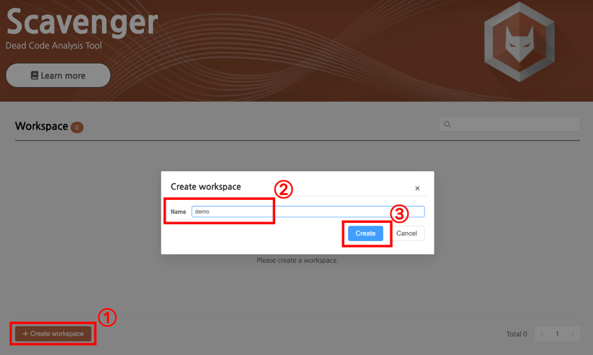
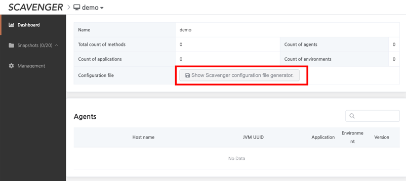
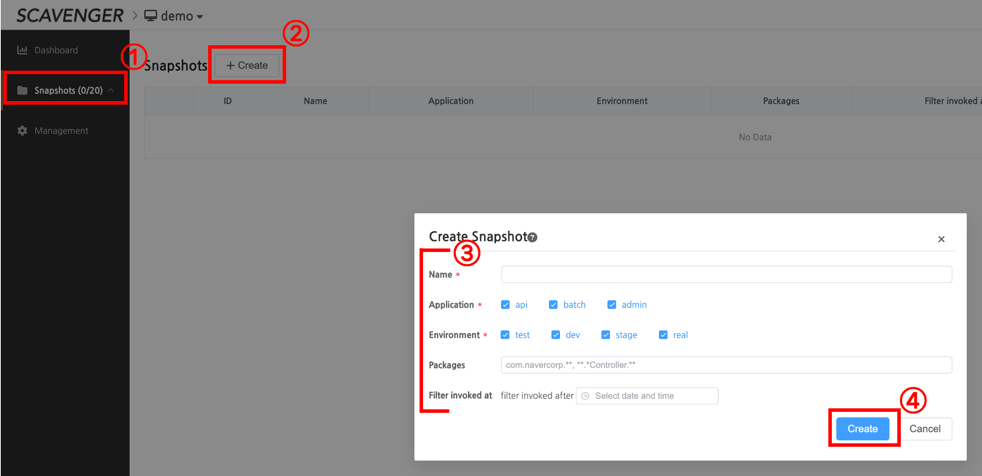
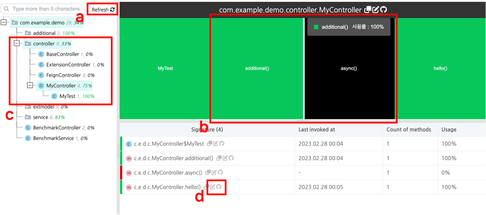

# User Guide

## Prerequisite

Before looking at the user guide, install the Collector, API.

* [
  How to install Collector?](https://github.com/naver/scavenger/blob/develop/doc/installation.md#install-collector)
* [
  How to install API?](https://github.com/naver/scavenger/blob/develop/doc/installation.md#install-api)

> This guide assumes that Collector uses port 8080 and the API uses port 8081.

## Create a workspace

Connect to `http://{API host}:8081/scavenger`.

1. Click the `Create workspace` button in the bottom left corner.
2. When the `Create workspace` modal appears, fill in the workspace name.
3. Click the `Create` button to create the workspace.

## Create a configuration file

* When using the Scavenger Agent, you need a configuration file for what settings you want the agent to run with.
* scavenger provides a feature to create a configuration file to make it easier to set up the agent.

* Click the `Show Scavenger configuration file generator` button.

* When the `Create scavenger configuration file` modal appears
    1. set the configuration.
    2. Click the `Download` button to download the configuration.
* For a detailed overview of the configuration, please refer
  to [the Configuration guide](https://github.com/naver/scavenger/blob/develop/doc/installation.md#configuration-2).

## Create Snapshot

Based on the information gathered by the scavenger collector, we take a snapshot to see the invocation history of a method after a specific moment in
time, as if we were dumping memory.

1. Click `Snapshots` in the LNB menu.
2. Click the `Create` button.
3. When the `Create Snapshot` modal appears, Enter the configurations to create the snapshot.
4. Click the `Create` button to create the snapshot.

The snapshot configuration is as follows

| configuration     | Description                                                                                                                                                                                                                                                                                                                                                                                               |
|-------------------|-----------------------------------------------------------------------------------------------------------------------------------------------------------------------------------------------------------------------------------------------------------------------------------------------------------------------------------------------------------------------------------------------------------|
| Name              | <li>Name the snapshot.</li>                                                                                                                                                                                                                                                                                                                                                                               |
| Application       | <li>The applications to be included in the snapshot.</li><li>Multiple applications can be given.<li>For example, if your application consists of two sub-applications, api and batch, and they share a common module called core, you need to include the api and batch applications in the snapshot to merge the dead code information so that you can correctly detect the dead code in core.</li></li> |
| Environment       | <li>The environments to be included in the snapshot.</li><li>Multiple environments can be given.</li><li>You can create snapshots based on the data you collect for a specific environment or for all environments.</li>                                                                                                                                                                                  |
| Packages          | <li>The packages to be included. Multiple packages can be specified with `,` and supports ant matches such as `*`, `**`. If not given, includes all packages.</li>                                                                                                                                                                                                                                        |
| Filter invoked at | <li>Only invocations after the date are counted as invocations.</li><li>For Example, If you specify the value `2022.10.23 10:00`, methods that were invoked only before `2022.10.23 10:00` will be evaluated as dead code, that is, methods that are no longer invoked.</li>                                                                                                                              |

### Example of creating a snapshot
Let's assume you have a project consisting of api, batch, and admin applications, with api and batch using the core module and admin not using core.

If you want to see the dead code for core and service layer after 2022.10.23 15:00, you can create a snapshot like below.

## Analyze snapshots

* a) Recreate a snapshot based on the most recent invocation state currently collected.
* b) A graph of the call treemap within the selected package.
  * The larger the area, the higher the number of methods.
  * The lower the percentage of calls, the black color.
* c) Package-level invocation status (number of methods / invocation rate).
* d) Open the class in IntelliJ / Github.
